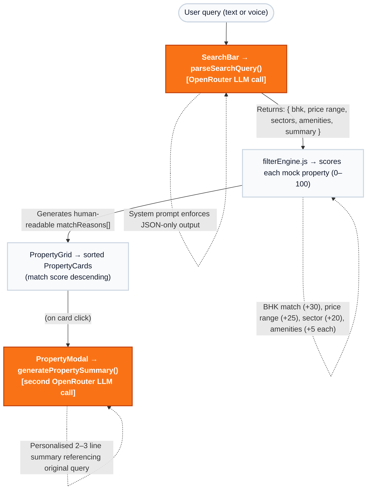

<div align="center">
  
  
  > India's first AI + VR real estate platform for Gurgaon & NCR.  
  > Built as a technical assignment for the Software Developer Intern role at 360 Ghar.

  [](#)
  [](#)
  [](#)
  [](#)
</div>


## 🌐 Live Demo
[https://360-ghar-assignment-omega.vercel.app/](https://360-ghar-assignment-omega.vercel.app/)

---

## ✨ Features

- **Natural language search** — describe your ideal home in plain English, the app parses it into structured filters via LLM
- **Smart property cards** — ranked by match score with contextual "why this matches" reason badges
- **AI property summary** — live LLM-generated 2–3 line personalised explanation when you open a property card
- **Voice input** — speak your search query using the browser's Web Speech API (mic button in search bar)
- **Shareable search links** — query is encoded in the URL; paste the link and the search auto-runs
- **Side-by-side comparison** — select any 2 properties and compare price, size, amenities, floor, and match score in a structured grid

---

## 💻 Tech Stack

| Layer | Choice |
|---|---|
| Framework | React 18 + Vite |
| Styling | Tailwind CSS + inline styles |
| LLM API | OpenRouter (`openrouter/free` auto-router) |
| Icons | lucide-react |
| Voice | Web Speech API (browser-native, no dependency) |
| Data | Mock JSON — 10 realistic Gurgaon properties |
| Deployment | Vercel |

**Model:** `openrouter/free`  
OpenRouter's official auto-router that dynamically selects from whichever free models are currently live. More resilient than pinning a specific model ID since the free roster rotates frequently. During development, requests were routed to `nvidia/nemotron-nano-12b-v2-vl:free` and `sourceful/riverflow-v2.5-fast:free` — the router picks the best available option per request.

---

## 🏗️ Architecture



All LLM calls are made directly from the frontend — no backend or server required.

---

## 📂 Folder Structure

```text
src/
├── components/
│   ├── SearchBar.jsx       # Text + voice input, filter pills
│   ├── PropertyGrid.jsx    # Results grid with skeleton loader
│   ├── PropertyCard.jsx    # Card with match score + reason badges
│   ├── PropertyModal.jsx   # Detail view with live AI summary
│   ├── CompareModal.jsx    # Side-by-side property comparison
│   └── ShareButton.jsx     # Copy shareable URL to clipboard
├── data/
│   └── properties.js       # 10 mock Gurgaon properties
├── services/
│   ├── openrouter.js       # LLM API calls (parse + summarise)
│   └── filterEngine.js     # Scoring + ranking logic
├── App.jsx
└── main.jsx
```
---
## 🛠️ Setup & Installation

```bash
git clone https://github.com/avnii-goel/360Ghar-Assignment.git
cd 360Ghar
npm install
cp .env.example .env
```

Add your OpenRouter API key to `.env`:
```
VITE_OPENROUTER_API_KEY=your_key_here
```

Get a free key (no credit card) at [openrouter.ai](https://openrouter.ai)

```bash
npm run dev
```
---

## 🧠 Prompt Design Notes

**Query parsing structure:**  
The system prompt instructs the model to return *only* valid JSON with no explanation, markdown, or code fences. The schema is defined inline in the prompt with explicit field types and rules — for example, prices are always normalised to lakhs (so "1 crore" becomes 100), and amenities are mapped to a fixed enum tag set rather than passed as free text. This makes the output deterministic and directly usable by the filter engine without secondary parsing.

**The `summary` field trick:**  
The parsed JSON includes a `summary` string — a one-sentence rephrasing of the user's query in second person. This drives the results header copy ("You are looking for…") without a separate LLM call.

**Property summary prompt:**  
The system prompt explicitly bans generic openers like "This property is perfect for you." and instructs the model to reference at least 2–3 concrete attributes from the property that align with the user's original query. This forces specificity over filler.

**What didn't work:**  
Asking the model to return both the parsed filters and a property ranking in a single call produced inconsistent JSON structure — the schema collapsed under the complexity. Splitting into two focused calls (parse → filter locally → summarise) gave far more reliable output.

**Model choice rationale:**  
`openrouter/free` was chosen over pinning a specific model ID because free-tier models on OpenRouter rotate frequently without notice — three different model slugs returned 404 during development (`gemma-3-27b-it:free`, `llama-3.1-8b-instruct:free`, `mistral-7b-instruct:free`). The auto-router handles availability transparently. For structured JSON tasks, the prompt quality matters more than the model — a strict schema prompt on a mid-size free model outperforms a loose prompt on a larger one.


---

## 📊 Mock Data

10 properties across Gurgaon sectors: 48, 50, 52, 56, 57, 82, DLF Phase 1–4.  
Price range: ₹45 Lakhs – ₹3.2 Cr. BHK range: 1–3. All data is realistic for the NCR market.

---

<div align="center">
  <em>Built with React + OpenRouter · Assignment submission for 360 Ghar</em>
</div>